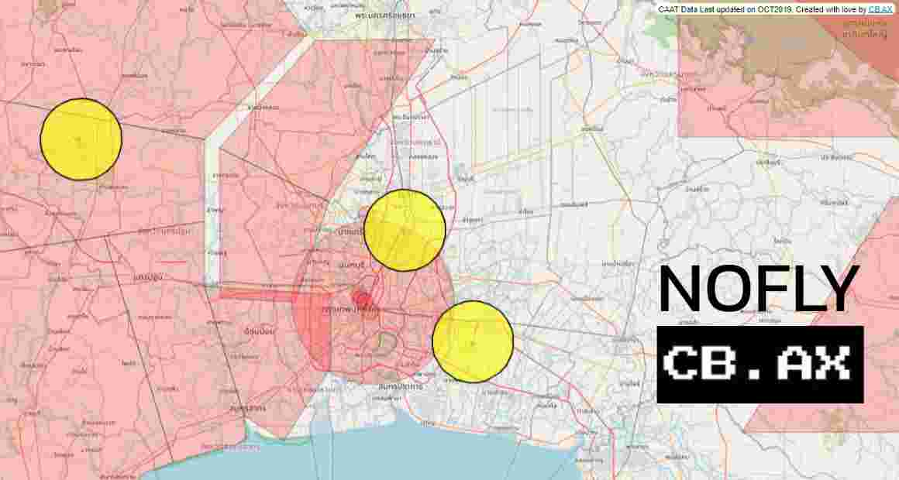

# cbax_nofly

No-fly area checking service at https://cb.ax/nofly

Overview
--------
This repository contains a small static web project for displaying and inspecting drone no-fly / restricted areas. The area data is stored as KMZ/KML files, and there are simple coordinate conversion tools in the `tools/` folder.

Purpose
-------
- Allow users to view no-fly areas using a web browser or mapping software that supports KMZ/KML files.
- Store sample area files (KMZ) and supporting images for inspection and visualization.
- Provide simple utility tools for coordinate conversion and formatting in the `tools/` folder.

Key files
---------
- `index.html` - Main static webpage for displaying maps / restricted areas
- `Aerodrome.kmz` - Sample KMZ file for aerodrome/airport-related zones
- `PDR-AREA.kmz` - Sample KMZ file for additional restricted areas
- `feature_img.jpg` - Example image or overlay used with the map
- `LICENSE.txt` - Project license information
- `tools/` - Utilities such as:
  - `converter.html` - Small converter/utility page
  - `DMS_Converter.html` - Degrees/Minutes/Seconds (DMS) coordinate converter

Quick usage
-----------
1. Open `index.html` in a web browser (Chrome, Firefox, Safari) by double-clicking it or using your browser's "Open File" option.
2. To view KMZ files in a dedicated application, open `Aerodrome.kmz` or `PDR-AREA.kmz` in Google Earth or any software that supports KMZ/KML.
3. For coordinate conversion or alternative coordinate formats, open the tools in the `tools/` folder (for example `converter.html` or `DMS_Converter.html`).

Caveats and disclaimers
-----------------------
- The area data included in this repository may not be up-to-date and should not be relied upon for legal or operational flight decisions. Always verify restrictions with the relevant authorities before any flight.
- This project is a visualization and convenience tool only. Final verification and responsibility remain with the user.

Development and local hosting
-----------------------------
This is a static project and does not require any special installation. Simply open `index.html` in a browser. If you prefer to serve the files locally during development, you can use a simple HTTP server such as Python's built-in server.

License
-------
See `LICENSE.txt` for license details.

Contact / Maintainers
---------------------
GitHub repository: https://github.com/parkcbax/cbax_nofly
For questions or contributions, please open an Issue or submit a Pull Request on the repository.

Contributing
------------
Contributions are welcome. Please follow the repository's contribution guidelines when submitting changes, improvements, additional examples, or new converters.

Final notes
-----------
This README is intended as a concise getting-started guide. If you'd like screenshots, deeper usage examples, or code samples added, tell me what you'd like and I'll update the file.
